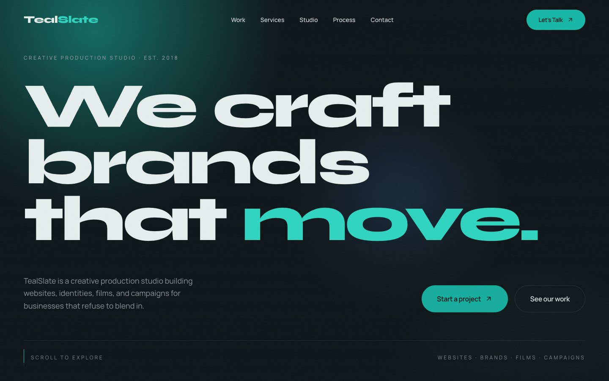

# TealSlate

**We craft brands that move.**

TealSlate is a creative production studio that builds websites, brand identities, films, and digital campaigns. This repository holds the studio's landing site. The site doubles as its portfolio piece, so it is cinematic, motion-led, and tuned for smooth performance on every screen size.



---

## Highlights

- **Push-in hero.** "move." is cut out of the page so the showreel plays inside the letters. Scrolling first glides "move." to the centre, then dives through the "o" until the footage fills the screen and becomes the showreel.
- **Interactive hero image trail.** Photos glide in along the cursor path, tilt, and fade as you move across the headline.
- **Darkroom photos.** Photos start undeveloped (soft focus, teal duotone) and develop into full colour as they scroll into focus or become active. They also lean slightly with scroll speed.
- **Cinematic preloader.** A 0→100 counter with the wordmark, then a curtain wipe that hands off to the hero animation.
- **Smooth scrolling.** Lenis runs from GSAP's ticker, so the smooth scroll and every scroll-driven animation update in the same frame.
- **Split-text reveals.** Headlines rise line by line, or word by word, from behind masks as they enter the viewport.
- **Scroll-scrubbed storytelling:**
  - The studio statement fills in word by word.
  - The process is a trail map: scrolling draws a winding route and walks a marker past each stop. Stops light up, their location prints pop in and develop, the next stop pulses, and stops preview on hover and jump there on click.
- **Meet the founders.** Each founder card is a film slate: it enters slate-side, the clapper snaps shut, and the card flips round to the founder. "Flip the slate" turns it back to read the take (production, roll, scene, take, director, focus, off camera). The cards also tilt toward the cursor under a light sheen.
- **Parallax photo collage.** Studio photos develop into focus, and each one drifts at its own speed.
- **Services through a viewfinder.** The section pins with a camera viewfinder in the middle: service titles scroll up through it while the photos scroll down, meeting in the frame, where the photo develops into colour and the details appear. Fully scroll-scrubbed, so it runs backwards as smoothly as forwards.
- **Selected work on black.** A near-black panel widens to full bleed as it scrolls in and narrows on the way out. A floating preview follows the cursor with spring physics, leans and squashes with pointer speed, leans into movement, and settles from a slight zoom as it opens. Project names roll letter by letter to teal, a highlight sweeps in from the edge the pointer entered, and each row wipes open as its divider draws in.
- **Custom cursor.** A dot and a trailing ring that change state over links and projects ("View"), and turn light over dark sections.
- **Magnetic interactions.** Buttons and the contact heading pull toward the cursor and spring back.
- **Velocity-aware client reel.** Client names speed up with fast scrolling, flip direction when you scroll up, and ease to a stop on hover.
- **Testimonials that spread.** The cards start as a tilted pile and fan out into a neat layout as you scroll, while each quote develops word by word. Hovering a card tilts it toward the cursor and dims the others. On smaller screens each card straightens into a stack.
- **Contact form.** Inline validation that glides to the first problem, loading and error states, and a send button that grows into the confirmation card.
- **Sticky footer reveal.** The footer sits underneath the page and is uncovered as you reach the bottom.

## Built with

| | |
|---|---|
| Framework | React 19 + Vite |
| Styling | Tailwind CSS v4, with design tokens defined via `@theme` |
| Scroll animation | GSAP, ScrollTrigger, SplitText (`@gsap/react`) |
| Interaction animation | Motion |
| Smooth scroll | Lenis |
| Icons | Lucide |
| Palette | Warm paper (#F5F2EC), deep slate ink (#14211F), teal (#0F766E) |
| Type | Plus Jakarta Sans (display) and Inter (body) |

**Motion rule of thumb:** GSAP owns everything driven by scrolling, and Motion owns everything driven by the pointer. The two never animate the same element.

## Accessibility & performance

- **Reduced motion.** `prefers-reduced-motion` turns off smooth scrolling, pinning, and cursor effects, and leaves simple fades in their place.
- **Semantics and focus.** The markup is semantic, there's a skip link, form labels are accessible, and focus states are visible.
- **Touch devices** get their own layouts, with no custom cursor and inline project images.
- **Cheap animation.** Only `transform`, `opacity`, and `clip-path` are animated, and every animation is cleaned up when its component unmounts.
- **Small, cacheable bundles.** Media loads lazily, and React, GSAP, and Motion ship as separately cached vendor chunks.
- **SEO.** Meta description, Open Graph, and Twitter card tags are in place.

## Project structure

```
src/
├── components/   Reusable UI and motion primitives (cursor, preloader, navbar, magnetic button, marquee…)
├── pages/        Routes: Home (/) and Contact (/contact)
├── sections/     Page sections: Hero (with showreel) → Clients → About → Services → Work → Process → Stats → Testimonials → Contact → Footer
├── hooks/        Lenis access, media queries, pointer position, magnetic behaviour
├── data/         All site copy and content (including founders)
├── assets/       Optimized WebP photography (see assets/images/CREDITS.md)
├── lib/          GSAP registration, motion presets, contact form integration
└── index.css     Design tokens, global styles, and keyframes
```

## Photography

The placeholder photography is from [Unsplash](https://unsplash.com) under the Unsplash License. Photographers are credited in `src/assets/images/CREDITS.md`.

## License

© 2026 TealSlate. All rights reserved.

This code, design, and content are proprietary. No permission is granted to copy, modify, redistribute, or reuse any part of this repository.

## Routing

The site has two pages, `/` (home) and `/contact`, using React Router. Moving between pages plays a short curtain transition instead of scrolling (see `src/components/PageTransition.jsx`); links to home sections from the contact page (Work, Services, and so on) land directly on that section.

Because `/contact` is a client-side route, the host must serve `index.html` for unknown paths (an SPA fallback). `npm run dev` and `npm run preview` already do this. On static hosting add a rewrite, for example `/* /index.html 200` in `public/_redirects` on Netlify, or a `rewrites` rule in `vercel.json` on Vercel.
